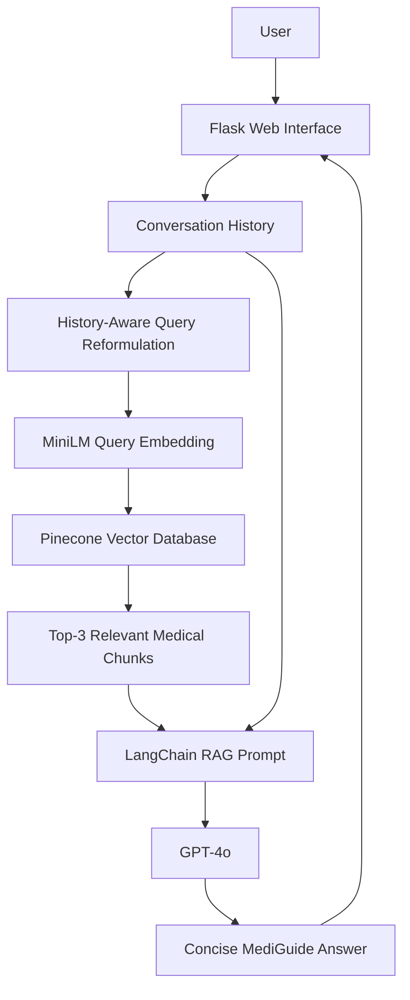
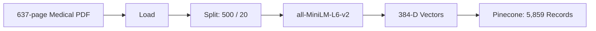

# MediGuide
## AI-Powered Analysis for Intelligent Healthcare Assistance

<p align="center">
  <strong>Retrieval-Augmented Medical Question Answering with Conversational Memory and AWS Deployment</strong>
</p>

<p align="center">
  Python • Flask • LangChain • GPT-4o • Pinecone • Sentence Transformers • Docker • Amazon ECR • Amazon EC2 • GitHub Actions
</p>

<p align="center">
  
</p>

<p align="center">
  <a href="https://youtu.be/7Pj-mZbR9ro">
    ▶ Watch the MediGuide Demo Video
  </a>
</p>

---

## Project Team

| Student | Student ID |
|---|---:|
| **Saurabh Kumbhar** | 25204974 |
| **Azim Hassan** | 25203062 |

---

## Table of Contents

- [Overview](#overview)
- [Research Question and Objective](#research-question-and-objective)
- [Key Features](#key-features)
- [System Architecture](#system-architecture)
- [RAG Pipeline](#rag-pipeline)
- [Conversational Memory](#conversational-memory)
- [Knowledge Base Configuration](#knowledge-base-configuration)
- [Retrieval Evaluation](#retrieval-evaluation)
- [Technology Stack](#technology-stack)
- [Project Structure](#project-structure)
- [How to Run](#how-to-run)
- [AWS CI/CD Deployment](#aws-cicd-deployment)
- [Operational Evidence](#operational-evidence)
- [Testing](#testing)
- [Security and Responsible AI](#security-and-responsible-ai)
- [Limitations](#limitations)
- [Conclusion](#conclusion)
- [Acknowledgements](#acknowledgements)

---

# Overview

**MediGuide** is an AI-powered healthcare question-answering application built using **Retrieval-Augmented Generation (RAG)**.

The system connects a **637-page medical reference** to a **5,859-vector Pinecone index**. For each question, MediGuide retrieves relevant medical evidence before GPT-4o generates a concise response.

> **Core idea:** Retrieve the right evidence first, then let the language model explain it.

The project demonstrates a complete workflow from document processing and retrieval to web delivery and cloud deployment.

> **Medical Disclaimer:** MediGuide is an academic and informational prototype. It is not a diagnosis, prescription, emergency service, or substitute for a qualified healthcare professional.

---

# Research Question and Objective

## Research Question

> **Can a large medical reference be transformed into fast, focused answers without fine-tuning a model?**

## Objective

Build an end-to-end RAG assistant that:

- retrieves domain-specific medical context,
- generates concise answers,
- supports conversational follow-up questions,
- serves responses through a web interface,
- and can be deployed automatically to AWS.

---

# Key Features

- **RAG-based medical question answering**
- **Semantic search using sentence embeddings**
- **Pinecone vector retrieval**
- **GPT-4o response generation**
- **History-aware follow-up questions**
- **Temporary conversational memory**
- **Custom Flask web interface**
- **Docker containerisation**
- **Amazon ECR image registry**
- **Amazon EC2 deployment**
- **GitHub Actions CI/CD**
- **EC2 self-hosted GitHub runner**

---

# System Architecture



---

# RAG Pipeline

## 1. Load Medical Reference

The medical PDF is loaded using LangChain PDF loaders.

```text
Medical PDF
   ↓
PyPDFLoader / DirectoryLoader
   ↓
LangChain Documents
```

## 2. Split into Chunks

| Parameter | Value |
|---|---:|
| Chunk size | 500 characters |
| Chunk overlap | 20 characters |

## 3. Generate Embeddings

Embedding model:

```text
sentence-transformers/all-MiniLM-L6-v2
```

Embedding dimension:

```text
384
```

## 4. Store in Pinecone

Pinecone index:

```text
mediguide
```

The index contains **5,859 dense vectors** using cosine similarity.

## 5. Retrieve Top Matches

```text
Top K = 3
```

## 6. Generate Answer

The retrieved context is passed to GPT-4o through LangChain.

Prompt behaviour includes:

```text
Use retrieved context.
If the evidence is insufficient, say that you do not know.
Keep the answer concise.
```

---

# Data-to-Knowledge Flow



---

# Conversational Memory

MediGuide stores recent conversation messages using:

```python
HumanMessage
AIMessage
```

Example:

```text
User: What is acne?
MediGuide: Acne is a common skin condition...

User: How can it be treated?
```

The second question is ambiguous by itself. The history-aware retriever reformulates it approximately as:

```text
How can acne be treated?
```

The current implementation stores the most recent **12 messages**, roughly six user-assistant exchanges.

---

# Knowledge Base Configuration

| Property | Value |
|---|---|
| Source | The Gale Encyclopedia of Medicine, 2nd ed. |
| Source length | 637 pages |
| Chunk size | 500 characters |
| Chunk overlap | 20 characters |
| Embedding model | `all-MiniLM-L6-v2` |
| Embedding dimension | 384 |
| Pinecone index | `mediguide` |
| Record count | 5,859 |
| Vector type | Dense |
| Similarity metric | Cosine |
| Pinecone region | AWS `us-east-1` |
| Retrieval | Top 3 passages |
| LLM | GPT-4o |

<p align="center">
  
</p>

---

# Retrieval Evaluation

A preliminary retrieval benchmark used **12 topic-focused prompts** with binary topic-label relevance.

| Metric | Result |
|---|---:|
| Precision@3 | **89%** |
| Hit Rate@3 | **100%** |
| MRR@3 | **96%** |

<p align="center">
  
</p>

> This evaluates retrieval performance only. It is not a clinical accuracy or medical safety evaluation.

---

# Technology Stack

| Layer | Technology |
|---|---|
| Language | Python 3.11 |
| Backend | Flask |
| AI orchestration | LangChain |
| LLM | OpenAI GPT-4o |
| Embeddings | Sentence Transformers |
| Embedding model | `all-MiniLM-L6-v2` |
| Vector database | Pinecone |
| PDF processing | PyPDF |
| Frontend | HTML, CSS, JavaScript |
| Containerisation | Docker |
| Cloud | AWS |
| Compute | Amazon EC2 |
| Container registry | Amazon ECR |
| CI/CD | GitHub Actions |
| Deployment runner | GitHub self-hosted runner |
| Version control | Git / GitHub |

---

# Project Structure

```text
projects-saurabh-azim/
│
├── .github/
│   └── workflows/
│       └── cicd.yaml
│
├── data/
│   └── Medical_book.pdf
│
├── research/
│   └── trials.ipynb
│
├── src/
│   ├── __init__.py
│   ├── helper.py
│   └── prompt.py
│
├── static/
│   └── style.css
│
├── templates/
│   └── chat.html
│
├── docs/
│   └── images/
│       ├── mediguide-home.png
│       ├── pinecone-overview.png
│       ├── pinecone-index.png
│       ├── pinecone-metrics.png
│       ├── pinecone-storage-records.png
│       └── retrieval-evaluation.png
│
├── .dockerignore
├── .gitignore
├── Dockerfile
├── app.py
├── requirements.txt
├── setup.py
├── store_index.py
└── README.md
```

---

# How to Run

## Prerequisites

Before running MediGuide, install:

- Git
- Conda
- Python 3.11
- pip

You also need:

- an OpenAI API key
- a Pinecone API key

---

## Step 1 — Clone the Repository

```bash
git clone https://github.com/ACM40960/projects-saurabh-azim.git
cd projects-saurabh-azim
```

---

## Step 2 — Create the Conda Environment

```bash
conda create -n mediguide python=3.11 -y
```

Activate it:

```bash
conda activate mediguide
```

---

## Step 3 — Install Requirements

```bash
pip install -r requirements.txt
```

---

## Step 4 — Configure Environment Variables

Create a `.env` file in the project root:

```env
PINECONE_API_KEY=your_pinecone_api_key
OPENAI_API_KEY=your_openai_api_key
```

> Do not commit the real `.env` file to GitHub.

A safe `.env.example` can contain:

```env
PINECONE_API_KEY=
OPENAI_API_KEY=
```

---

## Step 5 — Build the Pinecone Knowledge Base

Run:

```bash
python store_index.py
```

This performs:

```text
PDF
 ↓
Load
 ↓
Chunk
 ↓
Embed
 ↓
Pinecone
```

> Run `store_index.py` only when initially creating or intentionally rebuilding the knowledge base.

---

## Step 6 — Start MediGuide

Run:

```bash
python app.py
```

For local development, open:

```text
http://127.0.0.1:8080
```

For Docker/EC2 deployment, Flask binds to:

```text
0.0.0.0:8080
```

---

## Step 7 — Test the Health Endpoint

```bash
curl http://127.0.0.1:8080/health
```

Example response:

```json
{
  "application": "MediGuide",
  "status": "healthy",
  "model": "gpt-4o",
  "index": "mediguide"
}
```

---

# Docker

## Build the Image

```bash
docker build -t mediguide .
```

## Run the Container

```bash
docker run -d \
  --name mediguide-app \
  -p 8080:8080 \
  --env-file .env \
  mediguide
```

## Check Status

```bash
docker ps
```

## View Logs

```bash
docker logs mediguide-app
```

---

# AWS CI/CD Deployment

MediGuide uses the following deployment architecture:


This fixes the Mermaid rendering issue caused by using `/health` directly as an unquoted node label.

---

## Step 1 — AWS Account

Log in to the AWS console.

---

## Step 2 — Create IAM Deployment Credentials

The CI/CD workflow needs permission to work with Amazon ECR.

For the academic deployment, the project uses AWS credentials stored securely in GitHub Actions Secrets.

Typical permissions used during setup include access to:

- Amazon ECR
- Amazon EC2

Never place AWS access keys directly inside source code or workflow files.

---

## Step 3 — Create an Amazon ECR Repository

Create an ECR repository named:

```text
mediguide
```

The CI workflow builds the application Docker image and pushes:

```text
mediguide:latest
```

to ECR.

---

## Step 4 — Create an EC2 Instance

Create an Ubuntu EC2 instance.

The deployed application runs inside a Docker container on the instance.

The EC2 Security Group should allow the ports required for your deployment, including port `8080` when accessing Flask directly.

---

## Step 5 — Install Docker on EC2

Connect to EC2 and run:

```bash
sudo apt-get update -y
```

Install Docker:

```bash
curl -fsSL https://get.docker.com -o get-docker.sh
sudo sh get-docker.sh
```

Allow the Ubuntu user to run Docker:

```bash
sudo usermod -aG docker ubuntu
newgrp docker
```

Verify:

```bash
docker --version
```

---

## Step 6 — Configure EC2 as a GitHub Self-Hosted Runner

In GitHub:

```text
Repository
  → Settings
  → Actions
  → Runners
  → New self-hosted runner
```

Choose:

```text
Linux
x64
```

Then execute the GitHub-provided registration commands on EC2.

After registration, install the runner as a service:

```bash
cd ~/actions-runner
sudo ./svc.sh install
sudo ./svc.sh start
sudo ./svc.sh status
```

The runner should appear in GitHub as:

```text
Idle
Linux
X64
self-hosted
```

---

## Step 7 — Configure GitHub Actions Secrets

Go to:

```text
Repository
  → Settings
  → Secrets and variables
  → Actions
```

Add:

```text
AWS_ACCESS_KEY_ID
AWS_SECRET_ACCESS_KEY
AWS_DEFAULT_REGION
ECR_REPO
PINECONE_API_KEY
OPENAI_API_KEY
```

---

## Continuous Integration

The CI job runs on:

```text
ubuntu-latest
```

It performs:

```text
Checkout
   ↓
Configure AWS Credentials
   ↓
Login to Amazon ECR
   ↓
Build Docker Image
   ↓
Push Image to ECR
```

---

## Continuous Deployment

The CD job runs on:

```text
self-hosted
```

It performs:

```text
Login to ECR
   ↓
Pull Latest Image
   ↓
Stop Old Container
   ↓
Remove Old Container
   ↓
Run mediguide-app
   ↓
Health Check
```

The deployment uses a fixed container name:

```text
mediguide-app
```

to avoid Docker-generated names such as random adjective/name combinations.

---

## Triggering Deployment

The workflow is triggered whenever code is pushed to:

```text
main
```

If a redeployment is required without changing files:

```bash
git commit --allow-empty -m "Redeploy MediGuide application"
git push origin main
```

---

# Operational Evidence

## MediGuide Interface

<p align="center">
  
</p>

## Pinecone Project Overview

<p align="center">
  
</p>

## Pinecone Index

<p align="center">
  
</p>

## Pinecone Metrics

<p align="center">
  
</p>

## Storage and Record Count

<p align="center">
  
</p>

---

# Testing

## Local Test

```bash
python app.py
```

## Docker Test

```bash
docker build -t mediguide:test .
```

```bash
docker run --rm \
  -p 8080:8080 \
  --env-file .env \
  mediguide:test
```

## Health Check

```bash
curl http://127.0.0.1:8080/health
```

## Container Inspection

```bash
docker ps -a
```

## Container Logs

```bash
docker logs mediguide-app
```

---

# Security and Responsible AI

The project applies the following practices:

- `.env` is excluded from version control.
- API keys are loaded through environment variables.
- deployment credentials are stored in GitHub Secrets.
- Docker images do not contain the local `.env`.
- the repository is private.
- AWS credentials are not hard-coded.
- retrieved context is used as the primary evidence source.
- the system is clearly presented as an educational prototype.

Users should not submit identifying or sensitive medical information.

---

# Limitations

- The medical reference is from **2002** and may not reflect current clinical guidance.
- The current benchmark evaluates retrieval only, not clinical accuracy.
- Responses do not yet display page-level evidence citations.
- Conversation memory is temporary and is lost on server restart.
- The current memory implementation is primarily suitable for a demonstration rather than a multi-user production system.
- The application depends on external OpenAI and Pinecone services.
- Production deployment would require stronger privacy, monitoring, safety and clinical validation.

---

# Conclusion

MediGuide demonstrates a complete end-to-end RAG application for medical information retrieval.

The system integrates:

- a 637-page medical reference,
- 5,859 Pinecone vectors,
- 384-dimensional sentence embeddings,
- Top-3 semantic retrieval,
- GPT-4o,
- history-aware conversational RAG,
- Flask,
- Docker,
- Amazon ECR,
- Amazon EC2,
- and GitHub Actions CI/CD.

The prototype shows how retrieval can narrow a large medical corpus to relevant evidence before an LLM converts that evidence into a readable response.

---

# Acknowledgements

This project was developed as part of the **MSc Data & Computational Science programme at University College Dublin**.

The implementation was inspired by existing medical RAG examples and extended with project-specific:

- MediGuide interface design,
- conversational memory,
- history-aware retrieval,
- Pinecone configuration,
- retrieval evaluation,
- Docker packaging,
- AWS deployment,
- and automated CI/CD.

---

## MediGuide

**AI-Powered Analysis for Intelligent Healthcare Assistance**

`Python` • `Flask` • `LangChain` • `GPT-4o` • `Pinecone` • `Sentence Transformers` • `Docker` • `Amazon EC2` • `Amazon ECR` • `GitHub Actions`

## Project Team

| Student | Student ID |
|---|---:|
| **Saurabh Rajkumar Kumbhar** | 25204974 |
| **Azim Hassan** | 25203062 |

---
