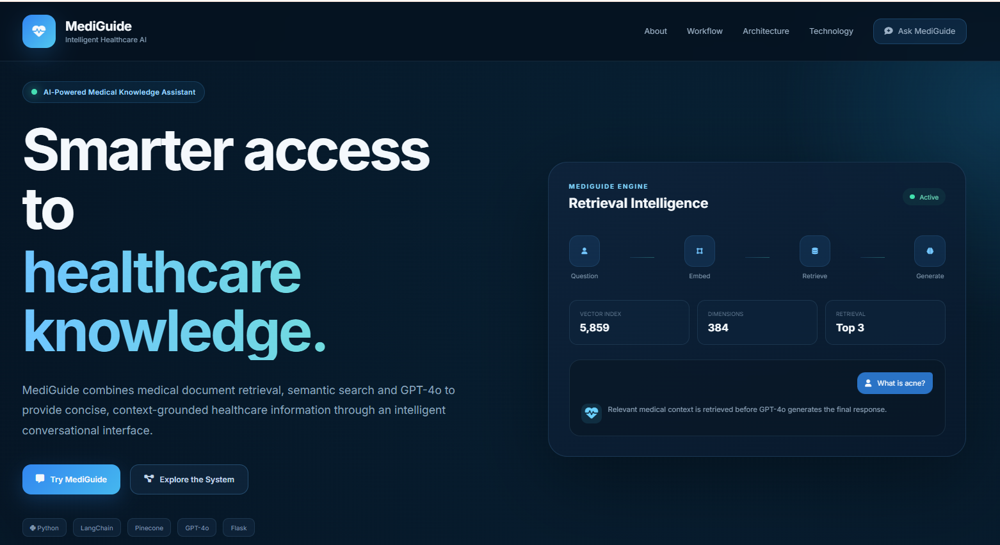
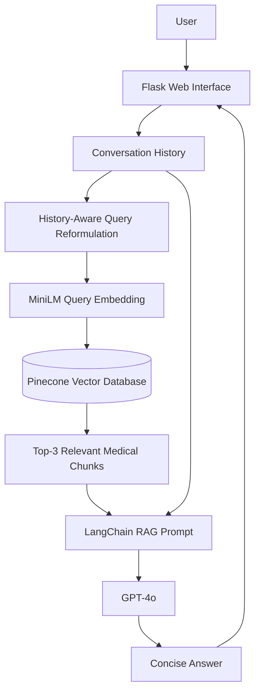
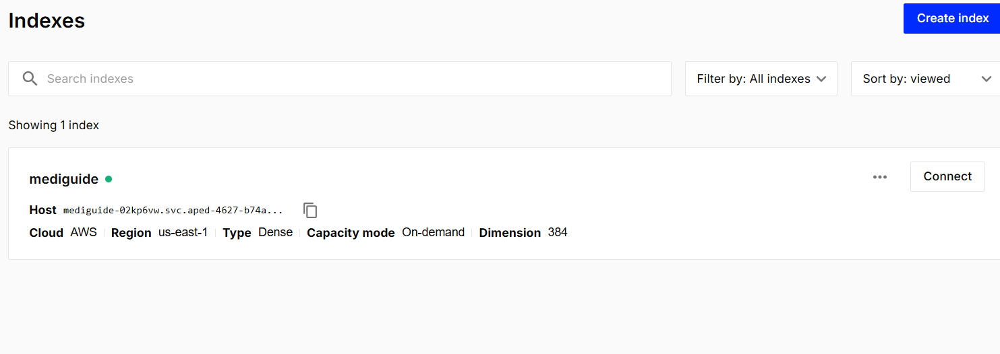
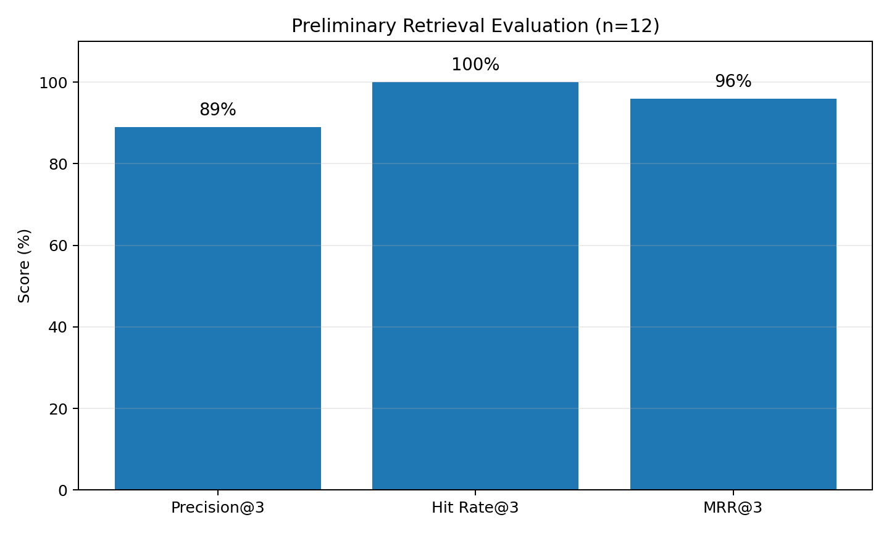
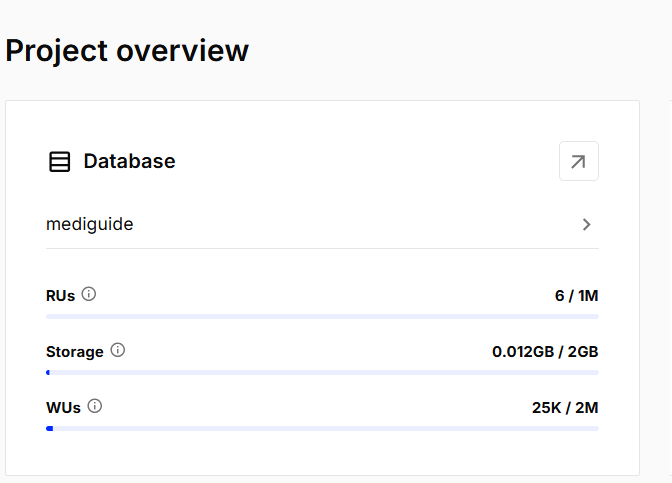
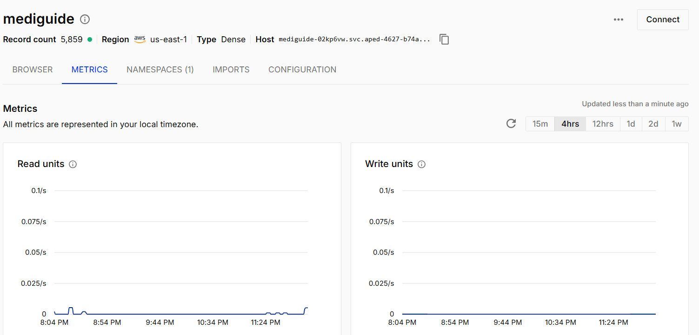
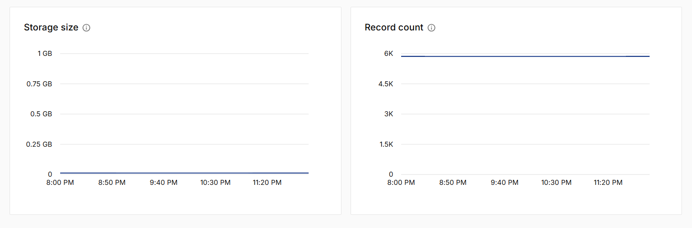

# MediGuide
## AI-Powered Analysis for Intelligent Healthcare Assistance

<p align="center">
  <strong>Retrieval-Augmented Medical Question Answering with Conversational Memory and AWS Deployment</strong>
</p>

<p align="center">
  Python • Flask • LangChain • GPT-4o • Pinecone • Sentence Transformers • Docker • Amazon ECR • Amazon EC2 • GitHub Actions
</p>

<p align="center">
  
</p>

---

## Project Team

| Student | Student ID |
|---|---:|
| **Saurabh Kumbhar** | 25204974 |
| **Azim Hassan** | 25203062 |

---

## Overview

**MediGuide** is an AI-powered healthcare question-answering application built using **Retrieval-Augmented Generation (RAG)**.

The project connects a **637-page medical reference** to a **5,859-vector Pinecone index** and uses semantic retrieval before GPT-4o generates a final answer. The key idea is:

> **Retrieve the right evidence first, then let the language model explain it.**

The complete system includes document ingestion, chunking, embedding generation, Pinecone vector retrieval, history-aware conversational RAG, a Flask web interface, Docker containerisation, Amazon ECR image storage, EC2 deployment and GitHub Actions CI/CD.

> **Medical disclaimer:** MediGuide is an academic and informational prototype. It is not a diagnosis, prescription, emergency service or replacement for a qualified healthcare professional.

---

## Research Question

> **Can a large medical reference be transformed into fast, focused answers without fine-tuning a model?**

### Objective

Build an end-to-end RAG assistant that:

- retrieves relevant medical context,
- generates a concise response,
- supports conversational follow-up questions,
- serves responses through a web application,
- and is deployable through an automated cloud pipeline.

---

## Key Features

- **Retrieval-Augmented Generation** — answers are grounded in retrieved medical context.
- **Semantic Search** — meaning-based retrieval using dense embeddings.
- **Pinecone Vector Database** — 5,859 medical vectors stored for fast cosine similarity search.
- **GPT-4o** — used for query reformulation and final response generation.
- **Conversational Memory** — recent user/assistant messages are retained.
- **History-Aware Retrieval** — follow-up questions are rewritten into standalone retrieval queries.
- **Responsive Flask UI** — custom HTML/CSS/JavaScript frontend.
- **Dockerised Deployment** — reproducible container environment.
- **GitHub Actions CI/CD** — automated build and deployment.
- **AWS Deployment** — Docker image stored in ECR and deployed to EC2.

---

## System Architecture



---

## RAG Pipeline

### 1. Load the medical reference

The source document is loaded with LangChain PDF loaders.

### 2. Split into chunks

Current text-splitting configuration:

| Parameter | Value |
|---|---:|
| Chunk size | 500 characters |
| Chunk overlap | 20 characters |

### 3. Generate embeddings

Embedding model:

```text
sentence-transformers/all-MiniLM-L6-v2
```

Embedding dimension:

```text
384
```

### 4. Store in Pinecone

Pinecone index:

```text
mediguide
```

The index contains **5,859 dense vectors** and uses **cosine similarity**.

### 5. Retrieve top matches

For every question, MediGuide retrieves:

```text
Top K = 3
```

### 6. Generate response

The retrieved context is passed to GPT-4o through LangChain.

A prompt guardrail instructs the model to rely on retrieved context and say that it does not know when evidence is insufficient.

---

## Data-to-Knowledge Flow


---

## Conversational Memory

MediGuide uses LangChain message objects:

```python
HumanMessage
AIMessage
```

Example:

```text
User: What is acne?
MediGuide: Acne is a common skin condition...

User: How can it be treated?
```

Without history, the second question is ambiguous.

With history-aware retrieval, MediGuide interprets it approximately as:

```text
How can acne be treated?
```

The current application stores the most recent **12 messages**, representing roughly six user-assistant exchanges.

---

## Knowledge Base Configuration

| Property | Value |
|---|---|
| Source | The Gale Encyclopedia of Medicine, 2nd ed. |
| Source length | 637 pages |
| Chunk size | 500 |
| Chunk overlap | 20 |
| Embedding model | `all-MiniLM-L6-v2` |
| Embedding dimension | 384 |
| Pinecone index | `mediguide` |
| Record count | 5,859 |
| Vector type | Dense |
| Similarity metric | Cosine |
| Pinecone region | AWS `us-east-1` |
| Retrieval | Top 3 passages |
| LLM | GPT-4o |

<p align="center">
  
</p>

---

## Preliminary Retrieval Evaluation

A small retrieval benchmark was performed using **12 topic-focused prompts** with binary topic-label relevance.

| Metric | Result |
|---|---:|
| Precision@3 | **89%** |
| Hit Rate@3 | **100%** |
| MRR@3 | **96%** |

<p align="center">
  
</p>

> **Important:** This evaluates retrieval only. It is not a clinical accuracy evaluation and should not be interpreted as evidence of medical safety or diagnostic performance.

---

## Technology Stack

| Layer | Technology |
|---|---|
| Language | Python 3.11 |
| Backend | Flask |
| RAG orchestration | LangChain |
| LLM | OpenAI GPT-4o |
| Embeddings | Sentence Transformers |
| Embedding model | `all-MiniLM-L6-v2` |
| Vector database | Pinecone |
| PDF processing | PyPDF |
| Frontend | HTML, CSS, JavaScript |
| Containerisation | Docker |
| Cloud | AWS |
| Compute | Amazon EC2 |
| Registry | Amazon ECR |
| CI/CD | GitHub Actions |
| Deployment runner | GitHub self-hosted runner |
| Version control | Git / GitHub |

---

## Project Structure

```text
projects-saurabh-azim/
│
├── .github/
│   └── workflows/
│       └── cicd.yaml
│
├── data/
│   └── Medical_book.pdf
│
├── research/
│   └── trials.ipynb
│
├── src/
│   ├── __init__.py
│   ├── helper.py
│   └── prompt.py
│
├── static/
│   └── style.css
│
├── templates/
│   └── chat.html
│
├── docs/
│   └── images/
│       ├── mediguide-home.png
│       ├── pinecone-overview.png
│       ├── pinecone-index.png
│       ├── pinecone-metrics.png
│       ├── pinecone-storage-records.png
│       └── retrieval-evaluation.png
│
├── .dockerignore
├── .gitignore
├── Dockerfile
├── app.py
├── requirements.txt
├── setup.py
├── store_index.py
└── README.md
```

---

## Important Files

### `app.py`
Main backend application responsible for environment loading, Pinecone connection, GPT-4o configuration, history-aware retrieval, RAG execution, chat memory and the `/health` endpoint.

### `src/helper.py`
Contains reusable functions for PDF loading, metadata filtering, chunking and embedding initialization.

### `src/prompt.py`
Contains query-reformulation and question-answering prompts plus conversation-history placeholders.

### `store_index.py`
Builds the vector knowledge base and uploads embeddings to Pinecone.

### `templates/chat.html`
Defines the interactive MediGuide frontend.

### `static/style.css`
Contains the responsive interface styling.

### `Dockerfile`
Defines the application container.

### `.github/workflows/cicd.yaml`
Builds the Docker image, pushes it to ECR and deploys it to EC2.

---

## Local Setup

### Prerequisites

- Git
- Conda
- Python 3.11
- OpenAI API access
- Pinecone account

### Clone

```bash
git clone https://github.com/ACM40960/projects-saurabh-azim.git
cd projects-saurabh-azim
```

### Create environment

```bash
conda create -n mediguide python=3.11 -y
conda activate mediguide
```

### Install dependencies

```bash
pip install -r requirements.txt
```

---

## Environment Variables

Create a `.env` file:

```env
OPENAI_API_KEY=your_openai_api_key
PINECONE_API_KEY=your_pinecone_api_key
```

Never commit real secrets.

A safe `.env.example` can contain:

```env
OPENAI_API_KEY=
PINECONE_API_KEY=
```

---

## Build the Knowledge Base

```bash
python store_index.py
```

Pipeline:

```text
Medical PDF
   ↓
Load
   ↓
Clean Metadata
   ↓
Split
   ↓
Embed
   ↓
Upload to Pinecone
```

Only re-index when the knowledge base intentionally changes.

---

## Running the Application

```bash
python app.py
```

Local development URL:

```text
http://127.0.0.1:8080
```

For Docker/EC2, Flask binds to:

```text
0.0.0.0:8080
```

---

## Docker Deployment

Build:

```bash
docker build -t mediguide .
```

Run:

```bash
docker run -d \
  --name mediguide-app \
  -p 8080:8080 \
  --env-file .env \
  mediguide
```

Status:

```bash
docker ps
```

Logs:

```bash
docker logs mediguide-app
```

---

## AWS Deployment

```mermaid
flowchart LR
    A[Push to main] --> B[GitHub Actions CI]
    B --> C[Docker Build]
    C --> D[(Amazon ECR)]
    D --> E[GitHub Actions CD]
    E --> F[EC2 Self-Hosted Runner]
    F --> G[Pull Latest Image]
    G --> H[mediguide-app]
    H --> I[/health]
```

### Continuous Integration

Runs on:

```text
ubuntu-latest
```

Steps:

```text
Checkout
  ↓
Configure AWS Credentials
  ↓
Login to ECR
  ↓
Build Docker Image
  ↓
Push Image to ECR
```

### Continuous Deployment

Runs on:

```text
self-hosted
```

Steps:

```text
Checkout
  ↓
Configure AWS Credentials
  ↓
Login to ECR
  ↓
Pull Latest Image
  ↓
Stop/Remove Old Container
  ↓
Run mediguide-app
  ↓
Verify /health
```

### GitHub Secrets

```text
AWS_ACCESS_KEY_ID
AWS_SECRET_ACCESS_KEY
AWS_DEFAULT_REGION
ECR_REPO
OPENAI_API_KEY
PINECONE_API_KEY
```

---

## Operational Evidence

### MediGuide Interface

<p align="center">
  
</p>

### Pinecone Project Overview

<p align="center">
  
</p>

### Pinecone Index

<p align="center">
  
</p>

### Pinecone Metrics

<p align="center">
  
</p>

### Storage and Record Count

<p align="center">
  
</p>

---

## Testing

### Health check

```bash
curl http://127.0.0.1:8080/health
```

### Container status

```bash
docker ps -a
```

### Container logs

```bash
docker logs mediguide-app
```

---

## Security and Responsible AI

MediGuide follows several implementation practices:

- API keys are loaded through environment variables.
- `.env` is excluded from version control.
- deployment credentials are stored in GitHub Secrets.
- Docker images do not contain the local `.env`.
- the repository is private.
- the self-hosted runner is scoped to the project.
- retrieved context is used as the main evidence source.
- the prototype is explicitly positioned as educational support only.

Users should **not enter identifying or sensitive personal medical information** into the prototype.

---

## Limitations

### Outdated source material
The indexed medical source is from 2002 and may not reflect current clinical guidance.

### Retrieval evaluation is not clinical evaluation
The 12-question benchmark evaluates retrieval relevance only.

### No evidence citations in answers
The current interface does not display page-level source citations or confidence.

### Temporary memory
Conversation history is stored in memory and is lost when the application restarts.

### Multi-user isolation
The current memory approach is primarily suitable for demonstration; production deployment needs per-user session memory.

### Logging
The current implementation may print user queries to application logs.

### External dependencies
The application depends on OpenAI and Pinecone availability, credentials and quotas.

---

## Conclusion

MediGuide demonstrates a complete route from a large medical reference document to a usable, cloud-deployed AI information assistant.

The prototype integrates:

- PDF ingestion,
- chunking,
- sentence embeddings,
- Pinecone retrieval,
- RAG,
- conversational memory,
- GPT-4o,
- Flask,
- Docker,
- Amazon ECR,
- Amazon EC2,
- GitHub Actions CI/CD.

The system shows the practical value of RAG for domain-grounded question answering. Real clinical use would require **current evidence, clinician-reviewed evaluation, stronger safety controls, privacy protections and production-grade infrastructure**.

---

## Acknowledgements

This project was developed as part of the **MSc Data & Computational Science programme at University College Dublin**.

The implementation was inspired by existing medical RAG examples and extended with MediGuide-specific interface design, conversational retrieval, memory, Pinecone configuration, retrieval evaluation, Docker packaging, AWS infrastructure and automated CI/CD.

---

## MediGuide

**AI-Powered Analysis for Intelligent Healthcare Assistance**

`Python` • `Flask` • `LangChain` • `GPT-4o` • `Pinecone` • `Sentence Transformers` • `Docker` • `Amazon EC2` • `Amazon ECR` • `GitHub Actions`
